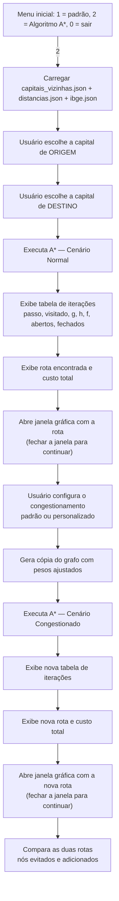

# Manipulação de Grafos


Projeto desenvolvido para implementar e explorar conceitos fundamentais da Teoria dos Grafos, incluindo criação, manipulação, análise, visualização interativa e otimização de rotas com o algoritmo A*.

---

## Sumário

- [Visão Geral](#visão-geral)
- [Funcionalidades](#funcionalidades)
- [Algoritmo A* — Otimização de Rotas](#algoritmo-a--otimização-de-rotas)
- [Tecnologias e Pré-requisitos](#tecnologias-e-pré-requisitos)
- [Estrutura do Projeto](#estrutura-do-projeto)
- [Instalação](#instalação)
- [Guia de Uso — Passo a Passo](#guia-de-uso--passo-a-passo)
- [Exemplo Completo Verificado](#exemplo-completo-verificado)
- [Formato dos Arquivos de Dados](#formato-dos-arquivos-de-dados)
- [Solução de Problemas](#solução-de-problemas)
- [Autores e Contexto Acadêmico](#autores-e-contexto-acadêmico)

---

## Visão Geral

Este projeto permite trabalhar com diferentes operações e algoritmos relacionados a grafos, utilizando estruturas de dados baseadas em listas de adjacência (dicionários Python).

Ao iniciar, o programa apresenta um **menu inicial** com duas frentes independentes:

1. **Manipulação genérica de grafos** — o usuário define seus próprios vértices e ligações e acessa operações clássicas de Teoria dos Grafos (matrizes, buscas, fechos transitivos, coloração, visualização).
2. **Algoritmo A\*** — otimização de rotas entre as 26 capitais brasileiras, com simulação de cenários normal e de congestionamento, totalmente independente do grafo da primeira opção.

O projeto foi desenvolvido com foco educacional, como atividade da disciplina de Grafos.

---

## Funcionalidades

### Manipulação de Grafos
- Adição de vértices
- Remoção de vértices (com atualização automática das listas de adjacência)
- Adição de arestas/ligações
- Remoção de arestas/ligações

### Representações
- Lista de adjacência (estrutura principal, dicionário `{vértice: [vizinhos]}`)
- Matriz de adjacência (gerada sob demanda, suporta grafos dirigidos e não dirigidos)

### Algoritmos Implementados
- Busca em Largura (BFS)
- Busca em Profundidade (DFS)
- Verificação de conexidade (grafos dirigidos via fecho transitivo direto/inverso; não dirigidos via BFS)
- Fecho transitivo direto
- Fecho transitivo inverso
- Coloração heurística de grafos (ordenação por grau, atribuição greedy de cores)
- **Algoritmo A\*** para caminho de custo mínimo entre capitais brasileiras, com heurística admissível, malha de conexões realista e simulação de congestionamento

### Visualização Gráfica
- Visualização interativa do grafo manipulado (menu 1), com Tkinter: movimentação dos vértices com o mouse, redesenho dinâmico das arestas e coloração visual (até 8 cores nomeadas; excedentes em cinza)
- Visualização da rota encontrada pelo Algoritmo A* (menu 2): janela horizontal mostrando cada capital do trajeto, as setas de conexão e a distância em km de cada trecho, além do custo total da rota

---

## Algoritmo A* — Otimização de Rotas

Esta é a funcionalidade central da atividade avaliativa: encontrar o caminho de custo mínimo entre duas capitais brasileiras, considerando tanto a distância real por estrada quanto uma estimativa heurística baseada em distância em linha reta.

### Conceito do Algoritmo

O A* seleciona o próximo nó a expandir com base em:

```
f(n) = g(n) + h(n)
```

- **g(n)** — custo real acumulado da origem até o nó `n` (soma das distâncias por estrada percorridas)
- **h(n)** — heurística: distância em linha reta (tabela IBGE) entre `n` e o destino
- **f(n)** — estimativa do custo total do caminho que passa por `n`; usada para ordenar a fila de prioridade (heap)

A heurística é **admissível** — a linha reta nunca é maior que a distância real por estrada — o que garante que o caminho retornado seja sempre o de menor custo possível no grafo dado.

### Malha de Conexões Realista (`capitais_vizinhas.json`)

O arquivo `distancias.json` traz a distância rodoviária entre praticamente **todas** as combinações de capitais — incluindo pares muito distantes, como São Paulo e Manaus. Se o grafo do A* fosse montado diretamente a partir dessas distâncias, cada capital ficaria conectada a quase todas as outras, e o caminho "mais barato" entre duas capitais quaisquer seria, na maioria das vezes, **uma única aresta direta** — o que não reflete a malha rodoviária real do Brasil (não existe uma estrada ligando diretamente São Paulo a Manaus).

Para corrigir isso, `capitais_vizinhas.json` define, para cada capital, **apenas as capitais vizinhas consideradas conectadas por rotas rodoviárias relevantes**. O grafo usado pelo A* é construído a partir dessa malha (buscando o valor em km correspondente em `distancias.json`), resultando em um grafo esparso e muito mais próximo da realidade.

O efeito prático é significativo. Por exemplo, para **São Paulo → Manaus**:

| | Caminho | Custo |
|---|---|---|
| Usando `distancias.json` diretamente | São Paulo → Manaus (1 trecho) | 3.971 km |
| Usando `capitais_vizinhas.json` | São Paulo → Campo Grande → Cuiabá → Porto Velho → Manaus (4 trechos) | 4.065 km |

Com a malha realista, o algoritmo precisa de fato **explorar caminhos compostos por várias capitais intermediárias**, e um congestionamento em um trecho importante passa a ter impacto real na rota escolhida — o que torna os cenários da atividade muito mais significativos.

### Fluxo de Execução



### Cenários Simulados

1. **Cenário normal** — utiliza os pesos da malha de capitais vizinhas, sem alterações.
2. **Cenário de congestionamento** — multiplica o peso de trechos selecionados por um fator, simulando rotas mais lentas. O grafo original **não é alterado** (é feita uma cópia independente via `deepcopy`), garantindo que o cenário normal permaneça correto para a comparação.

O conjunto padrão de congestionamento representa as rodovias historicamente mais movimentadas do país:

| Trecho | Fator exibido no menu |
|---|---|
| São Paulo ↔ Rio de Janeiro (Via Dutra) | 3.0× |
| São Paulo ↔ Curitiba | 2.5× |
| Rio de Janeiro ↔ Belo Horizonte | 2.0× |
| Brasília ↔ Goiânia | 2.0× |

> **Observação sobre o fator efetivo:** o dicionário de trechos padrão já cadastra as duas direções de cada par (ex.: São Paulo→Curitiba **e** Curitiba→São Paulo, ambas com fator 2.5). Como a aplicação do congestionamento espelha cada entrada nos dois sentidos, essas arestas específicas acabam recebendo o fator **ao quadrado** (2.5× × 2.5× = 6.25×; 3.0× vira 9.0×; 2.0× vira 4.0×). Na prática isso torna o desvio causado pelo congestionamento ainda mais perceptível — o que ajuda a evidenciar, na apresentação, em quais pontos o "trânsito" força uma rota diferente.

Também é possível definir trechos e fatores personalizados durante a execução.

---

## Tecnologias e Pré-requisitos

- **Linguagem:** Python **3.10 ou superior** (o menu utiliza a sintaxe `match/case`, disponível a partir do Python 3.10)
- **Paradigma:** Programação Estruturada

**Bibliotecas externas (instaladas via pip):**
- `networkx`
- `matplotlib`

**Bibliotecas da biblioteca padrão (já incluídas no Python):**
- `collections` — fila (`deque`) usada em BFS e nos fechos transitivos
- `tkinter` — interface gráfica interativa (grafo manipulado e rotas do A*)
- `random` — posicionamento inicial dos vértices na visualização do grafo manipulado
- `shutil` — centralização de texto no terminal
- `json` — leitura dos arquivos de dados do A*
- `heapq` — fila de prioridade (heap) do algoritmo A*

> **Nota sobre o Tkinter:** em distribuições Linux baseadas em Debian/Ubuntu, o Tkinter normalmente não vem pré-instalado junto com o Python e precisa ser instalado separadamente pelo gerenciador de pacotes do sistema (não pelo pip). Veja a seção [Solução de Problemas](#solução-de-problemas).

---

## Estrutura do Projeto

```
Manipulaco_Grafo/
│
├── main.py                  # Arquivo principal — menu inicial e algoritmos de grafo
├── algoritmo_A.py            # Implementação do Algoritmo A* e simulação de congestionamento
├── visualizacao_rota.py        # Janela gráfica (Tkinter) com a rota encontrada pelo A*
├── capitais.json                # Lista oficial das 26 capitais, na ordem usada no menu do A*
├── capitais_vizinhas.json         # Malha de conexões rodoviárias relevantes entre capitais
├── distancias.json                  # Distâncias por estrada entre capitais (consulta de pesos)
├── ibge.json                          # Distâncias em linha reta entre capitais (heurística h(n))
├── requirements.txt                    # Dependências externas do projeto
└── README.md                            # Documentação do projeto
```

> Os arquivos `algoritmo_A.py`, `visualizacao_rota.py`, `capitais.json`, `capitais_vizinhas.json`, `distancias.json` e `ibge.json` devem estar **na mesma pasta** que `main.py`, pois são lidos/importados com caminhos relativos.

---

## Instalação

### 1. Clone o repositório
```bash
git clone https://github.com/rafaelcunhaa/Manipulaco_Grafo.git
```

### 2. Acesse a pasta do projeto
```bash
cd Manipulaco_Grafo
```

### 3. Instale as dependências
```bash
pip install -r requirements.txt
```

Ou, manualmente:
```bash
python -m pip install networkx matplotlib
```

### 4. Verifique os arquivos de dados
Confirme que `capitais.json`, `capitais_vizinhas.json`, `distancias.json` e `ibge.json` estão presentes na raiz do projeto — eles são obrigatórios para o Algoritmo A*.

### 5. Execute o projeto
```bash
python main.py
```

---

## Guia de Uso — Passo a Passo

### Etapa 1 — Menu inicial

Ao iniciar, o programa exibe o cabeçalho ASCII e pergunta diretamente:

```
Deseja usar o algoritmo padrão de grafos ou Algoritmo A*? (1 = padrão, 2 = A*, 0 = sair):
```

- **`1`** → manipulação genérica de grafos (Etapa 2)
- **`2`** → Algoritmo A* (Etapa 3) — **acesso direto**, sem precisar definir nenhum grafo manualmente antes
- **`0`** → encerra o programa

### Etapa 2 — Manipulação genérica de grafos (opção 1)

Esta opção solicita primeiro a definição de um grafo de trabalho:

```
Qual numeros terá no grafo? (Ex:0,1):
A,B,C,D

Informe qual numero faz ligação com o A (Ex:0,1):
B,C

Informe qual numero faz ligação com o B (Ex:0,1):
A,D

Informe qual numero faz ligação com o C (Ex:0,1):
A,D

Informe qual numero faz ligação com o D (Ex:0,1):
B,C
```

Em seguida:

```
O grafo é dirigido ou não dirigido? (1 = dirigida, 2 = não dirigida):
```

Digite `1` para dirigido ou `2` para não dirigido. Qualquer valor diferente de 1 ou 2 mostra um aviso e retorna ao menu inicial.

Depois, o submenu de operações é exibido em loop:

```
O que deseja fazer?
 1  = Criar matriz
 2  = Varredura do grafo
 3  = Adicionar vertice
 4  = Adicionar ligação
 5  = Remover vertice
 6  = Remover ligação
 7  = Verificar se o grafo é conexo ou desconexo
 8  = Fecho transitivo direto
 9  = Fecho transitivo inverso
 10 = Colorir grafo
 11 = Autores
 0  = Voltar ao menu inicial
```

| Opção | Funcionalidade | Descrição |
|---|---|---|
| 1 | Criar matriz | Exibe a matriz de adjacência (dirigida ou não, conforme escolhido) |
| 2 | Varredura do grafo | Busca um valor específico via DFS/BFS, ou exibe a varredura completa de um dos dois |
| 3 | Adicionar vértice | Insere um novo vértice e suas ligações |
| 4 | Adicionar ligação | Cria uma nova aresta entre dois vértices existentes |
| 5 | Remover vértice | Remove um vértice e todas as referências a ele |
| 6 | Remover ligação | Remove uma aresta entre dois vértices |
| 7 | Verificar conexidade | Indica se o grafo é conexo ou desconexo |
| 8 | Fecho transitivo direto | Lista os vértices alcançáveis a partir de um vértice escolhido |
| 9 | Fecho transitivo inverso | Lista os vértices que conseguem alcançar um vértice escolhido |
| 10 | Colorir grafo | Aplica coloração heurística e abre a visualização interativa colorida |
| 11 | Autores | Exibe os créditos do projeto e a disciplina de origem |
| 0 | Voltar | Retorna ao menu inicial (Etapa 1) |

### Etapa 3 — Algoritmo A* (opção 2)

**3.1 — Seleção da capital de origem**

```
Capitais disponíveis:
  1. Aracajú
  2. Belo Horizonte
  3. Belém
  4. Boa Vista
  5. Brasília
  ...
 26. Vitória

Digite o número ou nome da capital de ORIGEM:
```

A lista segue a ordem definida em `capitais.json`. É possível responder digitando o número (ex.: `19`) ou o nome da cidade (ex.: `Recife`). Se o nome digitado não corresponder exatamente, mas existir uma única cidade contendo o texto digitado, o programa pergunta se essa foi a cidade pretendida.

**3.2 — Seleção da capital de destino**

Mesma lógica da Etapa 3.1, com o rótulo `DESTINO`.

**3.3 — Cenário normal**

O programa executa o A* sobre a malha de capitais vizinhas e exibe:
- Uma tabela com cada passo da busca: vértice visitado, `g(n)`, `h(n)`, `f(n)`, lista de abertos e lista de fechados naquele momento
- A rota final encontrada (sequência de capitais)
- O custo total em quilômetros

**3.4 — Janela gráfica do cenário normal**

Uma janela Tkinter é aberta mostrando a rota na horizontal: cada capital como um nó (origem em azul, destino em laranja, intermediárias em verde), setas indicando o sentido do percurso, a distância em km de cada trecho e o custo total no topo. **Fechar essa janela é necessário para o programa continuar.**

**3.5 — Configuração do congestionamento**

```
┌─────────────────────────────────────────┐
│     CONFIGURAÇÃO DE CONGESTIONAMENTO    │
└─────────────────────────────────────────┘

Trechos padrão de congestionamento:
    1. São Paulo → Rio de Janeiro  (3.0x mais lento)
    2. Rio de Janeiro → São Paulo  (3.0x mais lento)
    3. São Paulo → Curitiba  (2.5x mais lento)
    4. Curitiba → São Paulo  (2.5x mais lento)
    5. Rio de Janeiro → Belo Horizonte  (2.0x mais lento)
    6. Belo Horizonte → Rio de Janeiro  (2.0x mais lento)
    7. Brasília → Goiânia  (2.0x mais lento)
    8. Goiânia → Brasília  (2.0x mais lento)

Usar trechos padrão? (s = sim / n = personalizar):
```

Digite `s` para usar o conjunto padrão, ou `n` para informar manualmente pares de cidades e fatores de congestionamento (fator mínimo de `1.0`).

**3.6 — Cenário de congestionamento**

O programa repete a busca A* sobre uma **cópia** do grafo com os pesos ajustados, exibindo a nova tabela de iterações, a nova rota e o novo custo.

**3.7 — Janela gráfica do cenário congestionado**

Uma segunda janela Tkinter é aberta, no mesmo formato da Etapa 3.4, mas com a rota (e distâncias) do cenário congestionado. Feche-a para o programa continuar.

**3.8 — Comparação final**

O programa finaliza com uma comparação automática: se a rota permaneceu a mesma (apenas com custo percebido maior) ou se houve desvio — listando os vértices evitados e os adicionados pela nova rota, e indicando quais trechos da rota fazem parte do congestionamento configurado.

---

## Exemplo Completo Verificado

Os números abaixo foram obtidos executando o código atual com os arquivos `distancias.json`, `ibge.json` e `capitais_vizinhas.json` do projeto, para a rota **Recife → Porto Alegre** com o congestionamento padrão.

### Cenário normal — Recife → Porto Alegre

| Passo | Visitado | g(n) | h(n) | f(n) |
|---|---|---|---|---|
| 1 | Recife | 0 | 2970.8 | 2970.8 |
| 2 | Maceió | 285 | 2770.7 | 3055.7 |
| 3 | Aracajú | 579 | 2572.2 | 3151.2 |
| 4 | João Pessoa | 120 | 3054.7 | 3174.7 |
| 5 | Salvador | 935 | 2298.3 | 3233.3 |
| 6 | Natal | 305 | 3161.6 | 3466.6 |
| 7 | Belo Horizonte | 2307 | 1338.9 | 3645.9 |
| 8 | São Paulo | 2893 | 850.6 | 3743.6 |
| 9 | Curitiba | 3301 | 546.7 | 3847.7 |
| 10 | Rio de Janeiro | 2741 | 1122.6 | 3863.6 |
| 11 | Florianópolis | 3601 | 375.4 | 3976.4 |
| 12 | Brasília | 2381 | 1613.5 | 3994.5 |
| 13 | Fortaleza | 800 | 3204.1 | 4004.1 |
| 14 | Porto Alegre | 4077 | 0.0 | 4077.0 |

**Resultado:** `Recife → Maceió → Aracajú → Salvador → Belo Horizonte → São Paulo → Curitiba → Florianópolis → Porto Alegre`, custo total **4.077 km** (8 trechos, 14 nós expandidos).

### Cenário com congestionamento padrão

Os passos 1 a 8 (até São Paulo) são **idênticos** ao cenário normal — os mesmos valores de g, h e f, pois nenhuma das arestas percorridas até ali está congestionada. A diferença aparece exatamente ao sair de São Paulo: o trecho São Paulo↔Curitiba está congestionado (fator efetivo 6.25×, ver observação na seção do Algoritmo A*), tornando-o caro demais. O algoritmo passa a preferir o desvio por Campo Grande, levando 21 nós expandidos até confirmar o destino.

**Resultado:** `Recife → Maceió → Aracajú → Salvador → Belo Horizonte → São Paulo → Campo Grande → Curitiba → Florianópolis → Porto Alegre`, custo total **5.674 km** (9 trechos, 21 nós expandidos).

### Comparação

| | Normal | Congestionado |
|---|---|---|
| Rota | Recife → ... → São Paulo → Curitiba → Florianópolis → Porto Alegre | Recife → ... → São Paulo → **Campo Grande** → Curitiba → Florianópolis → Porto Alegre |
| Custo | 4.077 km | 5.674 km |
| Trechos | 8 | 9 |
| Nó adicionado | — | Campo Grande |

Esse é exatamente o tipo de comparação pedido na atividade: a rota é **idêntica até São Paulo** e diverge apenas no trecho final, com o congestionamento de São Paulo↔Curitiba forçando a passagem por Campo Grande antes de seguir para Curitiba e Florianópolis.

---

## Formato dos Arquivos de Dados

### capitais.json
Array simples com os nomes das 26 capitais, na ordem em que devem ser exibidas no menu de seleção do A*:

```json
["Aracajú", "Belo Horizonte", "Belém", "...", "Vitória"]
```

### capitais_vizinhas.json
Dicionário onde cada chave é uma capital e o valor é a lista de capitais consideradas **diretamente conectadas** por rotas rodoviárias relevantes:

```json
{
  "São Paulo": ["Rio de Janeiro", "Belo Horizonte", "Curitiba", "Campo Grande"],
  "Curitiba": ["São Paulo", "Florianópolis", "Campo Grande"]
}
```

Para cada par `(cidade, vizinho)`, o carregador consulta `distancias.json` testando as chaves `"cidade:vizinho"` e `"vizinho:cidade"`, nessa ordem, para obter o peso da aresta.

> **Observação:** a relação não precisa ser simétrica no arquivo — se `A` lista `B` como vizinho, isso não obriga `B` a listar `A`. No conjunto de dados atual isso ocorre em alguns pares (ex.: Goiânia lista Cuiabá, mas Cuiabá não lista Goiânia de volta) sem comprometer a conectividade geral — todas as 26 capitais continuam alcançáveis entre si —, mas vale revisar a simetria ao adicionar novas capitais ou conexões.

### distancias.json
Dicionário "plano" (não aninhado), onde cada chave representa um par de cidades separado por `:` e o valor é a distância por estrada em quilômetros. Usado como **tabela de consulta** para os pesos das arestas definidas em `capitais_vizinhas.json`:

```json
{
  "São Paulo:Curitiba": 408,
  "Salvador:Aracajú": 356
}
```

### ibge.json
Dicionário aninhado, usado como heurística `h(n)`: para cada cidade de origem, um dicionário com a distância em linha reta até cada possível destino:

```json
{
  "São Paulo": {
    "Recife": 2124.4,
    "Curitiba": 337.3
  }
}
```

Durante a busca, `h(n)` é obtido como `ibge[n][destino_final]`.

---

## Solução de Problemas

**`ModuleNotFoundError: No module named 'tkinter'` (Linux)**
O Tkinter não é instalado via pip nessas distribuições. Instale pelo gerenciador de pacotes do sistema:
```bash
sudo apt install python3-tk
```

**`SyntaxError` ao executar `main.py`**
O menu utiliza `match/case`, disponível apenas a partir do Python 3.10. Verifique sua versão com `python --version` e atualize se necessário.

**`FileNotFoundError: distancias.json` (ou `ibge.json` / `capitais.json` / `capitais_vizinhas.json`)**
Esses arquivos são lidos com caminho relativo. Certifique-se de executar `python main.py` estando dentro da pasta do projeto, com todos os arquivos `.json` no mesmo diretório de `algoritmo_A.py`.

**O programa parece "travado" depois de mostrar a rota**
Isso é esperado: o Algoritmo A* abre uma janela gráfica (Tkinter) com a rota encontrada e aguarda até que ela seja **fechada manualmente** antes de continuar — isso acontece duas vezes (cenário normal e cenário congestionado).

**A janela gráfica da rota é mais larga que a tela**
A largura da janela cresce com o número de paradas da rota (`220px` por capital). Em rotas com muitas paradas — especialmente no cenário congestionado, que pode ter mais trechos — a janela pode ficar mais larga que a resolução do monitor. Redimensione a janela ou use scroll horizontal se necessário.

**Acentos exibidos incorretamente no terminal (Windows)**
Nomes de cidades como "São Paulo" ou "Florianópolis" podem aparecer com caracteres incorretos no `cmd.exe` padrão. Utilize o Windows Terminal ou PowerShell, ou execute `chcp 65001` antes de iniciar o programa para forçar a codificação UTF-8.

---

## Autores e Contexto Acadêmico

Este projeto foi desenvolvido como atividade da disciplina de **Grafos**, sob orientação do **Professor Rudimar Dazzi**. Os créditos também podem ser visualizados a qualquer momento dentro do próprio programa, através da opção **11** do submenu de manipulação de grafos.

- Rafael Cunha
- Gabriel Laus
- Guilherme Thomy