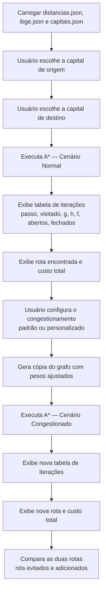

# Manipulação de Grafos


Projeto desenvolvido para implementar e explorar conceitos fundamentais da Teoria dos Grafos, incluindo criação, manipulação, análise, visualização interativa e otimização de rotas com o algoritmo A*.

---

## Sumário

- [Visão Geral](#visão-geral)
- [Funcionalidades](#funcionalidades)
- [Algoritmo A* — Otimização de Rotas](#algoritmo-a--otimização-de-rotas)
- [Tecnologias e Pré-requisitos](#tecnologias-e-pré-requisitos)
- [Estrutura do Projeto](#estrutura-do-projeto)
- [Instalação](#instalação)
- [Guia de Uso — Passo a Passo](#guia-de-uso--passo-a-passo)
- [Formato dos Arquivos de Dados](#formato-dos-arquivos-de-dados)
- [Solução de Problemas](#solução-de-problemas)
- [Autores e Contexto Acadêmico](#autores-e-contexto-acadêmico)

---

## Visão Geral

Este projeto permite trabalhar com diferentes operações e algoritmos relacionados a grafos, utilizando estruturas de dados baseadas em listas de adjacência (dicionários Python).

O sistema possui funcionalidades para:

- Criação de grafos dirigidos e não dirigidos a partir de entrada interativa do usuário
- Manipulação de vértices e arestas (adição e remoção)
- Percursos em grafos (BFS e DFS)
- Verificação de conexidade
- Cálculo de fecho transitivo direto e inverso
- Coloração heurística de vértices
- Visualização gráfica interativa com Tkinter
- **Otimização de rotas entre capitais brasileiras com o algoritmo A\***, incluindo simulação de cenários de congestionamento

O projeto foi desenvolvido com foco educacional, como atividade da disciplina de Grafos.

---

## Funcionalidades

### Manipulação de Grafos
- Adição de vértices
- Remoção de vértices (com atualização automática das listas de adjacência)
- Adição de arestas/ligações
- Remoção de arestas/ligações

### Representações
- Lista de adjacência (estrutura principal, dicionário `{vértice: [vizinhos]}`)
- Matriz de adjacência (gerada sob demanda, suporta grafos dirigidos e não dirigidos)

### Algoritmos Implementados
- Busca em Largura (BFS)
- Busca em Profundidade (DFS)
- Verificação de conexidade (grafos dirigidos via fecho transitivo direto/inverso; não dirigidos via BFS)
- Fecho transitivo direto
- Fecho transitivo inverso
- Coloração heurística de grafos (ordenação por grau, atribuição greedy de cores)
- **Algoritmo A\*** para caminho de custo mínimo entre capitais, com heurística admissível e simulação de congestionamento

### Visualização Gráfica
- Interface gráfica interativa utilizando Tkinter
- Movimentação dos vértices com o mouse (clique e arraste)
- Redesenho dinâmico das arestas durante a movimentação
- Visualização colorida dos grafos: cada cor da coloração heurística é mapeada para uma cor visual (vermelho, azul, verde, amarelo, laranja, roxo, rosa, ciano — até 8 cores; vértices adicionais aparecem em cinza)

---

## Algoritmo A* — Otimização de Rotas

Esta é a funcionalidade central da atividade avaliativa: encontrar o caminho de custo mínimo entre duas capitais brasileiras, considerando tanto a distância real por estrada quanto uma estimativa heurística baseada em distância em linha reta.

### Conceito do Algoritmo

O A* seleciona o próximo nó a expandir com base em:

```
f(n) = g(n) + h(n)
```

- **g(n)** — custo real acumulado da origem até o nó `n` (soma das distâncias por estrada percorridas)
- **h(n)** — heurística: distância em linha reta (tabela IBGE) entre `n` e o destino
- **f(n)** — estimativa do custo total do caminho que passa por `n`; usada para ordenar a fila de prioridade (heap)

A heurística é **admissível** — a linha reta nunca é maior que a distância real por estrada — o que garante que o caminho retornado seja sempre o de menor custo possível no grafo dado.

### Fluxo de Execução



### Cenários Simulados

1. **Cenário normal** — utiliza os pesos originais de `distancias.json` sem alterações.
2. **Cenário de congestionamento** — multiplica o peso de trechos selecionados por um fator (ex.: 2×, 2.5×, 3×), simulando rotas mais lentas. O grafo original **não é alterado** (é feita uma cópia independente via `deepcopy`), garantindo que o cenário normal permaneça correto para a comparação.

O conjunto padrão de congestionamento representa as rodovias historicamente mais movimentadas do país:

| Trecho | Fator |
|---|---|
| São Paulo ↔ Rio de Janeiro (Via Dutra) | 3.0× |
| São Paulo ↔ Curitiba | 2.5× |
| Rio de Janeiro ↔ Belo Horizonte | 2.0× |
| Brasília ↔ Goiânia | 2.0× |

Também é possível definir trechos e fatores personalizados durante a execução.

---

## Tecnologias e Pré-requisitos

- **Linguagem:** Python **3.10 ou superior** (o menu principal utiliza a sintaxe `match/case`, disponível a partir do Python 3.10)
- **Paradigma:** Programação Estruturada

**Bibliotecas externas (instaladas via pip):**
- `networkx`
- `matplotlib`

**Bibliotecas da biblioteca padrão (já incluídas no Python):**
- `collections` — fila (`deque`) usada em BFS e nos fechos transitivos
- `tkinter` — interface gráfica interativa
- `random` — posicionamento inicial dos vértices na visualização
- `shutil` — centralização de texto no terminal
- `json` — leitura dos arquivos de dados do A*
- `heapq` — fila de prioridade (heap) do algoritmo A*

> **Nota sobre o Tkinter:** em distribuições Linux baseadas em Debian/Ubuntu, o Tkinter normalmente não vem pré-instalado junto com o Python e precisa ser instalado separadamente pelo gerenciador de pacotes do sistema (não pelo pip). Veja a seção [Solução de Problemas](#solução-de-problemas).

---

## Estrutura do Projeto

```
Manipulaco_Grafo/
│
├── main.py            # Arquivo principal — menu interativo e algoritmos de grafo
├── algoritmo_A.py      # Implementação do Algoritmo A* e simulação de congestionamento
├── capitais.json        # Lista oficial das 26 capitais, na ordem usada pelo menu
├── distancias.json       # Distâncias por estrada entre capitais (pesos das arestas)
├── ibge.json               # Distâncias em linha reta entre capitais (heurística h(n))
├── requirements.txt         # Dependências externas do projeto
└── README.md                 # Documentação do projeto
```

> Os quatro arquivos `algoritmo_A.py`, `capitais.json`, `distancias.json` e `ibge.json` devem estar **na mesma pasta** que `main.py`, pois são lidos com caminhos relativos (`open("distancias.json", ...)`).

---

## Instalação

### 1. Clone o repositório
```bash
git clone https://github.com/rafaelcunhaa/Manipulaco_Grafo.git
```

### 2. Acesse a pasta do projeto
```bash
cd Manipulaco_Grafo
```

### 3. Instale as dependências
```bash
pip install -r requirements.txt
```

Ou, manualmente:
```bash
python -m pip install networkx matplotlib
```

### 4. Verifique os arquivos de dados
Confirme que `capitais.json`, `distancias.json` e `ibge.json` estão presentes na raiz do projeto — eles são obrigatórios para a opção 11 (Algoritmo A*).

### 5. Execute o projeto
```bash
python main.py
```

---

## Guia de Uso — Passo a Passo

### Etapa 1 — Definindo o grafo inicial

Ao iniciar, o programa sempre solicita primeiro a definição de um grafo de trabalho (usado pelas opções 1 a 10 do menu):

```
Qual numeros terá no grafo? (Ex:0,1):
A,B,C,D

Informe qual numero faz ligação com o A (Ex:0,1):
B,C

Informe qual numero faz ligação com o B (Ex:0,1):
A,D

Informe qual numero faz ligação com o C (Ex:0,1):
A,D

Informe qual numero faz ligação com o D (Ex:0,1):
B,C
```

> **Importante:** se o objetivo for usar **apenas o Algoritmo A\*** (opção 11), essas perguntas ainda precisam ser respondidas para o programa avançar até o menu — o módulo A* não utiliza esses valores, pois trabalha com seus próprios arquivos de dados (`distancias.json` e `ibge.json`). Uma entrada mínima como `A,B` com ligações vazias (apenas pressionar Enter) é suficiente para passar por esta etapa rapidamente.

### Etapa 2 — Tipo de grafo

```
O grafo é dirigido ou não dirigido? (1 = dirigida, 2 = não dirigida):
```

Digite `1` para dirigido ou `2` para não dirigido. Qualquer valor diferente de 1 ou 2 encerra o programa com uma mensagem de erro.

### Etapa 3 — Menu principal

```
O que deseja fazer?
 1  = Criar matriz
 2  = Varredura do grafo
 3  = Adicionar vertice
 4  = Adicionar ligação
 5  = Remover vertice
 6  = Remover ligação
 7  = Verificar se o grafo é conexo ou desconexo
 8  = Fecho transitivo direto
 9  = Fecho transitivo inverso
 10 = Colorir grafo
 11 = Algoritmo A*
 12 = Autores
```

| Opção | Funcionalidade | Descrição |
|---|---|---|
| 1 | Criar matriz | Exibe a matriz de adjacência (dirigida ou não, conforme escolhido na Etapa 2) |
| 2 | Varredura do grafo | Busca um valor específico via DFS/BFS, ou exibe a varredura completa de um dos dois |
| 3 | Adicionar vértice | Insere um novo vértice e suas ligações |
| 4 | Adicionar ligação | Cria uma nova aresta entre dois vértices existentes |
| 5 | Remover vértice | Remove um vértice e todas as referências a ele |
| 6 | Remover ligação | Remove uma aresta entre dois vértices |
| 7 | Verificar conexidade | Indica se o grafo é conexo ou desconexo |
| 8 | Fecho transitivo direto | Lista os vértices alcançáveis a partir de um vértice escolhido |
| 9 | Fecho transitivo inverso | Lista os vértices que conseguem alcançar um vértice escolhido |
| 10 | Colorir grafo | Aplica coloração heurística e abre a visualização interativa colorida |
| **11** | **Algoritmo A\*** | Otimização de rotas entre capitais brasileiras (ver Etapa 4) |
| 12 | Autores | Exibe os créditos do projeto e a disciplina de origem |

### Etapa 4 — Executando o Algoritmo A* (opção 11)

Ao escolher a opção 11, o fluxo é independente do grafo definido na Etapa 1:

**4.1 — Seleção da capital de origem**

```
Capitais disponíveis:
  1. Aracajú
  2. Belo Horizonte
  3. Belém
  4. Boa Vista
  5. Brasília
  ...
 26. Vitória

Digite o número ou nome da capital de ORIGEM:
```

A lista segue exatamente a ordem definida em `capitais.json`. É possível responder digitando o número (ex.: `9`) ou o nome da cidade (ex.: `Florianópolis`). Se o nome digitado não corresponder exatamente, mas existir uma única cidade contendo o texto digitado, o programa pergunta se essa foi a cidade pretendida.

**4.2 — Seleção da capital de destino**

Mesma lógica da Etapa 4.1, com o rótulo `DESTINO`.

**4.3 — Cenário normal**

O programa executa o A* com os pesos originais e exibe:
- Uma tabela com cada passo da busca: vértice visitado, `g(n)`, `h(n)`, `f(n)`, lista de abertos e lista de fechados naquele momento
- A rota final encontrada (sequência de capitais)
- O custo total em quilômetros

**4.4 — Configuração do congestionamento**

```
Trechos padrão de congestionamento:
  1. São Paulo → Rio de Janeiro  (3.0x mais lento)
  2. São Paulo → Curitiba        (2.5x mais lento)
  3. Rio de Janeiro → Belo Horizonte (2.0x mais lento)
  4. Brasília → Goiânia          (2.0x mais lento)

Usar trechos padrão? (s = sim / n = personalizar):
```

Digite `s` para usar o conjunto padrão, ou `n` para informar manualmente pares de cidades e fatores de congestionamento (fator mínimo de `1.0`).

**4.5 — Cenário de congestionamento e comparação**

O programa repete a busca A* sobre uma **cópia** do grafo com os pesos ajustados, exibe a nova tabela de iterações, a nova rota e custo, e finaliza com uma comparação automática: se a rota permaneceu a mesma (apenas com custo percebido maior) ou se houve desvio — listando os vértices evitados e os adicionados pela nova rota.

---

### Exemplo Completo Verificado (mini-grafo didático)

Para ilustrar exatamente o que cada coluna da tabela significa e como o congestionamento pode alterar a rota, considere o seguinte mini-grafo de 4 cidades, com distâncias e heurística (linha reta até o destino `D`) definidas abaixo. A execução com `distancias.json` e `ibge.json` reais segue **exatamente a mesma lógica**, apenas com 26 capitais e valores em quilômetros reais no lugar destes números simplificados.

**Grafo (distâncias por estrada):**

| Aresta | Distância |
|---|---|
| A ↔ B | 10 |
| A ↔ C | 15 |
| B ↔ D | 12 |
| C ↔ D | 8 |

**Heurística h(n) — linha reta até D:**

| Nó | h(n) |
|---|---|
| A | 18 |
| B | 11 |
| C | 7 |
| D | 0 |

**Cenário normal — busca de A até D:**

| Passo | Visitado | g(n) | h(n) | f(n) | Abertos | Fechados |
|---|---|---|---|---|---|---|
| 1 | A | 0 | 18 | 18 | — | [A] |
| 2 | B | 10 | 11 | 21 | [C] | [A, B] |
| 3 | C | 15 | 7 | 22 | [D] | [A, B, C] |
| 4 | D | 22 | 0 | 22 | — | [A, B, C, D] |

**Resultado:** rota `A → B → D`, custo total `22`.

**Cenário de congestionamento — trecho A↔B passa de 10 para 20 (fator 2×):**

| Passo | Visitado | g(n) | h(n) | f(n) | Abertos | Fechados |
|---|---|---|---|---|---|---|
| 1 | A | 0 | 18 | 18 | — | [A] |
| 2 | C | 15 | 7 | 22 | [B] | [A, C] |
| 3 | D | 23 | 0 | 23 | [B] | [A, C, D] |

**Resultado:** rota `A → C → D`, custo total `23`.

**Comparação:**

| | Normal | Congestionado |
|---|---|---|
| Rota | A → B → D | A → C → D |
| Custo | 22 | 23 |
| Vértices evitados | — | B |
| Vértices adicionados | — | C |

O congestionamento no trecho A↔B fez o algoritmo recalcular a rota inteira: como `f(C) = 22` ficou igual a `f(B) = 22` no cenário normal (empate resolvido por menor `g(n)`), um pequeno aumento no peso de A↔B foi suficiente para tornar o caminho via C definitivamente mais barato — exatamente o tipo de comportamento que se observa, em escala maior, ao congestionar rodovias entre capitais reais.

---

## Formato dos Arquivos de Dados

### capitais.json
Array simples com os nomes das 26 capitais, na ordem em que devem ser exibidas no menu de seleção do A*:

```json
["Aracajú", "Belo Horizonte", "Belém", "...", "Vitória"]
```

### distancias.json
Dicionário "plano" (não aninhado), onde cada chave representa um par de cidades separado por `:` e o valor é a distância por estrada em quilômetros:

```json
{
  "São Paulo:Curitiba": 408,
  "Curitiba:São Paulo": 408,
  "Salvador:Aracajú": 356
}
```

Pares no formato `"Cidade:Cidade"` com valor `0` (auto-relação) são ignorados pelo carregador. Pares que existem em apenas um sentido são espelhados automaticamente para o sentido inverso ao montar o grafo em memória, garantindo um grafo não dirigido completo.

### ibge.json
Dicionário aninhado, usado como heurística `h(n)`: para cada cidade de origem, um dicionário com a distância em linha reta até cada possível destino:

```json
{
  "São Paulo": {
    "Recife": 2124.4,
    "Curitiba": 337.3
  }
}
```

Durante a busca, `h(n)` é obtido como `ibge[n][destino_final]`.

---

## Solução de Problemas

**`ModuleNotFoundError: No module named 'tkinter'` (Linux)**
O Tkinter não é instalado via pip nessas distribuições. Instale pelo gerenciador de pacotes do sistema:
```bash
sudo apt install python3-tk
```

**`SyntaxError` ao executar `main.py`**
O menu principal utiliza `match/case`, disponível apenas a partir do Python 3.10. Verifique sua versão com `python --version` e atualize se necessário.

**`FileNotFoundError: distancias.json` (ou `ibge.json` / `capitais.json`)**
Esses arquivos são lidos com caminho relativo. Certifique-se de executar `python main.py` estando dentro da pasta do projeto, com os três arquivos `.json` no mesmo diretório de `algoritmo_A.py`.

**Acentos exibidos incorretamente no terminal (Windows)**
Nomes de cidades como "São Paulo" ou "Florianópolis" podem aparecer com caracteres incorretos no `cmd.exe` padrão. Utilize o Windows Terminal ou PowerShell, ou execute `chcp 65001` antes de iniciar o programa para forçar a codificação UTF-8.

---

## Autores e Contexto Acadêmico

Este projeto foi desenvolvido como atividade da disciplina de **Grafos**, sob orientação do **Professor Rudimar Dazzi**. Os créditos também podem ser visualizados a qualquer momento dentro do próprio programa, através da opção **12** do menu principal.

- Rafael Cunha
- Gabriel Laus
- Guilherme Thomy
